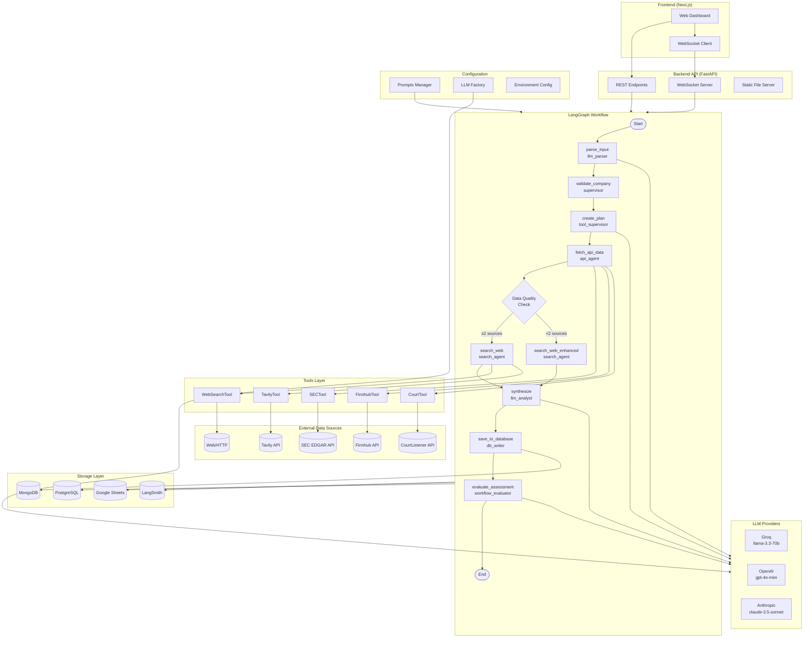
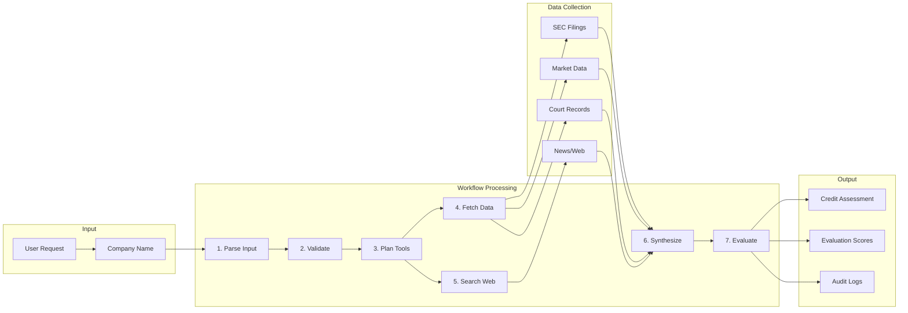
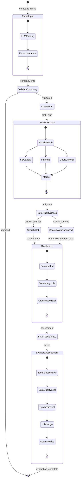
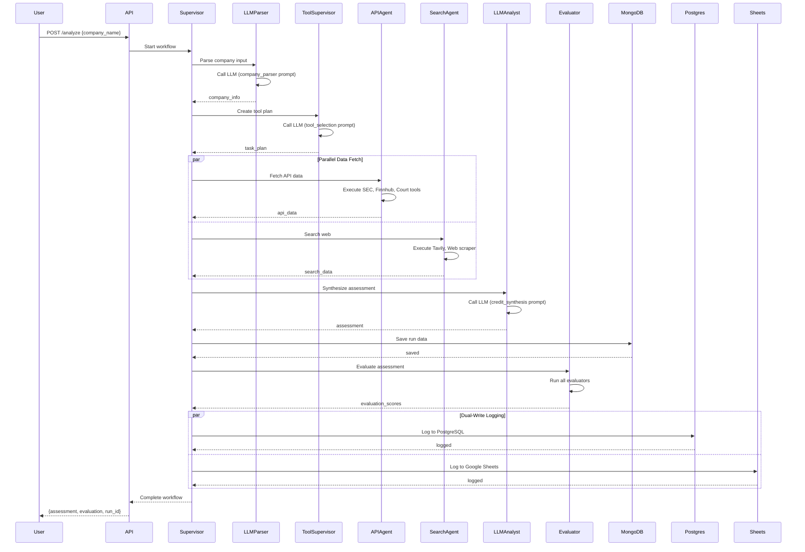

# Credit Intelligence System Architecture

## Overview

Credit Intelligence is a multi-agent system for automated credit risk assessment. It uses LangGraph for workflow orchestration, multiple LLM providers for analysis, and various data sources for information gathering.

---

## System Architecture Diagram



---

## Component Flow Diagram



---

## Module Dependency Diagram

```mermaid
flowchart TB
    subgraph EntryPoints["Entry Points"]
        CLI[cli.py]
        API_MAIN[backend/api/main.py]
    end

    subgraph Agents["src/agents/"]
        GRAPH[graph.py]
        SUP[supervisor.py]
        TOOL_SUP[tool_supervisor.py]
        API_AG[api_agent.py]
        SEARCH_AG[search_agent.py]
        LLM_AN[llm_analyst.py]
        LLM_PAR[llm_parser.py]
    end

    subgraph ToolsModule["src/tools/"]
        BASE_TOOL[base_tool.py]
        TOOL_EXEC[tool_executor.py]
        SEC_TOOL[sec_tool.py]
        FINN_TOOL[finnhub_tool.py]
        COURT_TOOL[court_tool.py]
        WEB_TOOL[web_search_tool.py]
    end

    subgraph DataSourcesModule["src/data_sources/"]
        SEC_DS[sec_edgar.py]
        FINN_DS[finnhub.py]
        COURT_DS[court_listener.py]
        TAV_DS[tavily_search.py]
        SCRAPER[web_scraper.py]
    end

    subgraph ConfigModule["src/config/"]
        PROMPTS_CFG[prompts.py]
        LLM_CFG[langchain_llm.py]
        PARSERS[output_parsers.py]
        EXT_CFG[external_config.py]
    end

    subgraph EvalModule["src/evaluation/"]
        WF_EVAL[workflow_evaluator.py]
    end

    subgraph LoggingModule["src/run_logging/"]
        WF_LOG[workflow_logger.py]
        SHEETS_LOG[sheets_logger.py]
        PG_LOG[postgres_logger.py]
        RUN_LOG[run_logger.py]
    end

    subgraph StorageModule["src/storage/"]
        MONGO_DB[mongodb.py]
        PG_STORE[postgres.py]
    end

    %% Entry point dependencies
    CLI --> GRAPH
    API_MAIN --> GRAPH
    API_MAIN --> MONGO_DB

    %% Graph dependencies
    GRAPH --> SUP & TOOL_SUP & API_AG & SEARCH_AG & LLM_AN & LLM_PAR
    GRAPH --> WF_EVAL
    GRAPH --> WF_LOG

    %% Agent dependencies
    TOOL_SUP --> TOOL_EXEC
    API_AG --> SEC_TOOL & FINN_TOOL & COURT_TOOL
    SEARCH_AG --> WEB_TOOL
    LLM_AN --> LLM_CFG & PROMPTS_CFG
    LLM_PAR --> LLM_CFG & PROMPTS_CFG

    %% Tool dependencies
    TOOL_EXEC --> BASE_TOOL
    SEC_TOOL --> SEC_DS
    FINN_TOOL --> FINN_DS
    COURT_TOOL --> COURT_DS
    WEB_TOOL --> TAV_DS & SCRAPER

    %% Config dependencies
    LLM_CFG --> MONGO_DB
    PROMPTS_CFG --> EXT_CFG

    %% Logging dependencies
    WF_LOG --> SHEETS_LOG & PG_LOG & RUN_LOG
    PG_LOG --> PG_STORE
    RUN_LOG --> MONGO_DB
```



---

## Entities Hierarchy Diagram (Database Schema)

This ER diagram shows all 18 tables in PostgreSQL/Google Sheets and their relationships. All tables are linked to `RUNS` via `run_id`.

```mermaid
erDiagram
    %% Core run table - central entity
    RUNS ||--o{ LLM_CALLS : "has many"
    RUNS ||--o{ TOOL_CALLS : "has many"
    RUNS ||--o{ LANGGRAPH_EVENTS : "has many"
    RUNS ||--o{ DATA_SOURCES : "has many"
    RUNS ||--o{ ASSESSMENTS : "has many"
    RUNS ||--|| EVALUATIONS : "has one"
    RUNS ||--|| TOOL_SELECTIONS : "has one"
    RUNS ||--o{ PLANS : "has many"
    RUNS ||--o{ PROMPTS : "has many"
    RUNS ||--o{ CONSISTENCY_SCORES : "has many"
    RUNS ||--o{ CROSS_MODEL_EVAL : "has many"
    RUNS ||--|| LLM_JUDGE_RESULTS : "has one"
    RUNS ||--|| AGENT_METRICS : "has one"
    RUNS ||--|| LOG_TESTS : "has one"

    RUNS {
        serial id PK
        string run_id UK "UUID"
        string company_name
        string status "pending|running|completed|failed"
        string risk_level "low|medium|high|critical"
        int credit_score "300-850"
        float confidence "0.0-1.0"
        text reasoning
        float overall_score
        string final_decision
        text decision_reasoning
        jsonb errors "array"
        jsonb warnings "array"
        jsonb tools_used "array"
        jsonb agents_used "array"
        timestamptz started_at
        timestamptz completed_at
        float duration_ms
        int total_tokens
        float total_cost
        int llm_calls_count
        float tool_overall_score "0.0-1.0"
        float agent_overall_score "0.0-1.0"
        float workflow_overall_score "0.0-1.0"
        timestamptz timestamp
    }

    LLM_CALLS {
        serial id PK
        string run_id FK
        string company_name
        string node
        string node_type
        string agent_name
        int step_number
        string call_type
        string model
        string provider "groq|openai|anthropic"
        float temperature
        text prompt
        text response
        text reasoning
        text context
        text current_task
        int prompt_tokens
        int completion_tokens
        int total_tokens
        float input_cost
        float output_cost
        float total_cost
        float execution_time_ms
        string status
        text error
        timestamptz timestamp
    }

    TOOL_CALLS {
        serial id PK
        string run_id FK
        string company_name
        string tool_name
        jsonb tool_input
        jsonb tool_output
        float execution_time_ms
        string status
        text error
        timestamptz timestamp
    }

    LANGGRAPH_EVENTS {
        serial id PK
        string run_id FK
        string company_name
        string event_type "node_start|node_end|edge"
        string node
        string agent_name
        float duration_ms
        timestamptz timestamp
    }

    DATA_SOURCES {
        serial id PK
        string run_id FK
        string company_name
        string source_name
        string source_type
        string status
        jsonb data_retrieved
        float execution_time_ms
        text error
        timestamptz timestamp
    }

    ASSESSMENTS {
        serial id PK
        string run_id FK
        string company_name
        string assessment_type
        string risk_level
        int credit_score
        float confidence
        text reasoning
        jsonb risk_factors
        jsonb positive_factors
        jsonb recommendations
        string model
        timestamptz timestamp
    }

    EVALUATIONS {
        serial id PK
        string run_id FK
        string company_name
        string evaluation_type
        float overall_score
        float tool_selection_score
        float data_quality_score
        float synthesis_score
        timestamptz timestamp
    }

    TOOL_SELECTIONS {
        serial id PK
        string run_id FK
        string company_name
        jsonb selected_tools "array"
        jsonb expected_tools "array"
        float precision_score
        float recall_score
        float f1_score
        timestamptz timestamp
    }

    PLANS {
        serial id PK
        string run_id FK
        string company_name
        string plan_type
        jsonb plan_steps "array"
        string model
        text reasoning
        timestamptz timestamp
    }

    PROMPTS {
        serial id PK
        string run_id FK
        string company_name
        string prompt_id
        string prompt_name
        string category
        text system_prompt
        text user_prompt
        jsonb variables
        string node
        string agent_name
        int step_number
        string model
        timestamptz timestamp
    }

    CONSISTENCY_SCORES {
        serial id PK
        string run_id FK
        string company_name
        string model
        int run_number
        string risk_level
        int credit_score
        float confidence
        float consistency_score
        timestamptz timestamp
    }

    CROSS_MODEL_EVAL {
        serial id PK
        string run_id FK
        string company_name
        string primary_model
        string secondary_model
        string primary_risk_level
        string secondary_risk_level
        int primary_credit_score
        int secondary_credit_score
        float agreement_score
        text differences
        timestamptz timestamp
    }

    LLM_JUDGE_RESULTS {
        serial id PK
        string run_id FK
        string company_name
        string judge_model
        float accuracy_score
        float completeness_score
        float consistency_score
        float overall_score
        text feedback
        jsonb detailed_scores
        timestamptz timestamp
    }

    AGENT_METRICS {
        serial id PK
        string run_id FK
        string company_name
        string agent_name
        float overall_score
        float intent_correctness
        float plan_quality
        float tool_choice_correctness
        float tool_completeness
        float trajectory_match
        float final_answer_quality
        timestamptz timestamp
    }

    LOG_TESTS {
        serial id PK
        string run_id FK
        string company_name
        string verification_status
        int total_tables_logged
        jsonb tables_verified
        timestamptz timestamp
    }

    API_KEYS {
        serial id PK
        string key_name UK
        text key_value
        timestamptz created_at
        timestamptz updated_at
    }

    COMPANIES {
        serial id PK
        string name
        string ticker
        string industry
        string sector
        string jurisdiction
        boolean is_public
        jsonb cached_data
        timestamptz last_updated
    }
```



### Table Relationships Summary

| Table | Relationship | Cardinality | Description |
|-------|-------------|-------------|-------------|
| runs | - | 1 | Central entity, one per workflow execution |
| llm_calls | runs.run_id | 1:N | Multiple LLM calls per run (parsing, synthesis, etc.) |
| tool_calls | runs.run_id | 1:N | Multiple tool executions per run |
| langgraph_events | runs.run_id | 1:N | Multiple workflow events per run |
| data_sources | runs.run_id | 1:N | Multiple data sources fetched per run |
| assessments | runs.run_id | 1:N | Multiple assessments (primary, secondary model) |
| evaluations | runs.run_id | 1:1 | One evaluation summary per run |
| tool_selections | runs.run_id | 1:1 | One tool selection decision per run |
| plans | runs.run_id | 1:N | Task plans created during run |
| prompts | runs.run_id | 1:N | Prompts used during run |
| consistency_scores | runs.run_id | 1:N | Multiple consistency checks |
| cross_model_eval | runs.run_id | 1:N | Cross-model comparisons |
| llm_judge_results | runs.run_id | 1:1 | One LLM judge evaluation per run |
| agent_metrics | runs.run_id | 1:1 | One agent metrics summary per run |
| log_tests | runs.run_id | 1:1 | One log verification per run |
| api_keys | - | - | Standalone, runtime API key storage |
| companies | - | - | Standalone, company data cache |

---

## Workflow State Machine



---

## Agent Interaction Diagram



---

## Canonical Agent Names

**IMPORTANT:** These are the exact `agent_name` values logged to Google Sheets.

| Node | agent_name | Description |
|------|------------|-------------|
| parse_input | `llm_parser` | Parses company input |
| validate_company | `supervisor` | Validates company |
| create_plan | `tool_supervisor` | LLM tool selection |
| fetch_api_data | `api_agent` | Fetches API data |
| search_web | `search_agent` | Web search (normal mode, ≥2 API sources) |
| search_web_enhanced | `search_agent` | Web search (enhanced mode, <2 API sources) |
| synthesize | `llm_analyst` | Credit synthesis |
| save_to_database | `db_writer` | Database storage |
| evaluate_assessment | `workflow_evaluator` | All evaluation tasks |

### LLM Call Types (logged in llm_calls sheet)

| call_type | Description |
|-----------|-------------|
| `company_parser` | Parse company input |
| `tool_selection` | Select tools to use |
| `credit_synthesis` | Synthesize assessment |
| `credit_analysis` | Full credit analysis |
| `validation` | Validate assessment |
| `tool_selection_evaluation` | Evaluate tool selection |

---

## Entity Hierarchy

```
WORKFLOW (LangGraph StateGraph)
│
├── RUN
│   ├── run_id: UUID (unique identifier)
│   ├── company_name: string
│   ├── started_at: timestamp
│   ├── completed_at: timestamp
│   └── status: pending | running | completed | failed
│
├── NODES (Graph Steps)
│   │
│   ├── parse_input
│   │   ├── Agent: llm_parser
│   │   ├── LLM Call: company_parser prompt
│   │   └── Output: company_info (ticker, jurisdiction, is_public)
│   │
│   ├── validate_company
│   │   ├── Agent: supervisor
│   │   ├── Human-in-the-loop: optional approval
│   │   └── Output: validation_status
│   │
│   ├── create_plan
│   │   ├── Agent: tool_supervisor
│   │   ├── LLM Call: tool_selection prompt
│   │   └── Output: task_plan (list of tools to execute)
│   │
│   ├── fetch_api_data
│   │   ├── Agent: api_agent
│   │   ├── Tools: SECTool, FinnhubTool, CourtTool
│   │   ├── Data Sources: SEC EDGAR, Finnhub, CourtListener
│   │   └── Output: api_data
│   │
│   ├── search_web (or search_web_enhanced via conditional routing)
│   │   ├── Agent: search_agent
│   │   ├── Conditional: route_after_api_data checks API data quality
│   │   │   ├── ≥2 API sources with data → search_web (normal)
│   │   │   └── <2 API sources with data → search_web_enhanced
│   │   ├── Tools: WebSearchTool, TavilySearch
│   │   ├── Data Sources: Tavily API, Web Scraper
│   │   └── Output: search_data
│   │
│   ├── synthesize
│   │   ├── Agent: llm_analyst
│   │   ├── LLM Calls: credit_synthesis prompt (primary + secondary model)
│   │   ├── Cross-Model Evaluation: compare results
│   │   ├── Same-Model Consistency: multiple runs
│   │   └── Output: assessment
│   │
│   ├── save_to_database
│   │   ├── Agent: db_writer
│   │   ├── Storage: MongoDB
│   │   └── Output: stored run record
│   │
│   └── evaluate_assessment
│       ├── Agent: workflow_evaluator (for ALL evaluation tasks)
│       ├── Evaluators: Tool selection, Data quality, Synthesis, LLM Judge, Agent efficiency
│       └── Output: evaluation scores
│
└── STATE (CreditWorkflowState)
    ├── Input: company_name, jurisdiction, ticker
    ├── Intermediate: company_info, task_plan, api_data, search_data, tool_selection
    ├── Output: assessment, evaluation
    └── Metadata: errors, status, execution_time_ms
```

---

## Detailed Entity Descriptions

### 1. WORKFLOW

**Location:** `src/agents/graph.py`

The workflow is a LangGraph StateGraph that orchestrates the entire credit assessment process.

| Property | Type | Description |
|----------|------|-------------|
| `graph` | StateGraph | LangGraph compiled graph |
| `state_class` | CreditWorkflowState | TypedDict defining all state fields |
| `entry_point` | string | First node to execute ("parse_input") |
| `nodes` | Dict[str, Callable] | Map of node names to functions (includes search_web_enhanced) |
| `edges` | List[Tuple] | Transitions between nodes |
| `conditionals` | Dict | Conditional routing logic (route_after_api_data for data quality) |

**Conditional Edges:**
1. After `validate_company` → routes to END if validation fails
2. After `fetch_api_data` → routes to `search_web` or `search_web_enhanced` based on data quality

---

### 2. RUN

**Location:** State managed across all nodes

A run represents a single execution of the workflow for one company.

| Property | Type | Description |
|----------|------|-------------|
| `run_id` | UUID string | Unique identifier for this run |
| `company_name` | string | Company being analyzed |
| `started_at` | ISO timestamp | When run started |
| `completed_at` | ISO timestamp | When run completed |
| `status` | string | Current status |
| `duration_ms` | float | Total execution time |
| `errors` | List[string] | Any errors encountered |

---

### 3. NODES

Each node is a function that transforms the workflow state.

#### 3.1 parse_input

**Purpose:** Parse company name and extract metadata using LLM

| Property | Value |
|----------|-------|
| step_number | 1 |
| node | "parse_input" |
| agent_name | **`llm_parser`** |
| prompt_id | "company_parser" |
| llm_provider | groq |
| llm_model | fast (llama-3.1-8b-instant) |
| temperature | 0.1 |

**Output:**
```python
{
    "run_id": "uuid",
    "company_info": {
        "is_public_company": bool,
        "ticker": str | None,
        "industry": str,
        "sector": str,
        "jurisdiction": str,
        "confidence": float
    }
}
```

#### 3.2 validate_company

**Purpose:** Validate parsed company info, optional human approval

| Property | Value |
|----------|-------|
| step_number | 2 |
| node | "validate_company" |
| agent_name | **`supervisor`** |
| human_in_loop | optional |

**Output:**
```python
{
    "human_approved": bool,
    "validation_message": str,
    "requires_review": bool
}
```

#### 3.3 create_plan

**Purpose:** LLM decides which tools to use for data collection

| Property | Value |
|----------|-------|
| step_number | 3 |
| node | "create_plan" |
| agent_name | **`tool_supervisor`** |
| prompt_id | "tool_selection" |
| llm_provider | groq |
| llm_model | primary (llama-3.3-70b-versatile) |
| temperature | 0.1 |

**Output:**
```python
{
    "task_plan": [
        {
            "tool": "sec_edgar",
            "params": {"ticker": "AAPL"},
            "reason": "Public company, need SEC filings"
        },
        {
            "tool": "finnhub",
            "params": {"ticker": "AAPL"},
            "reason": "Get market data and financials"
        }
    ],
    "tool_selection": {
        "model": "llama-3.3-70b-versatile",
        "reasoning": "Selected tools based on company type..."
    }
}
```

#### 3.4 fetch_api_data

**Purpose:** Execute API tools to collect structured data

| Property | Value |
|----------|-------|
| step_number | 4 |
| node | "fetch_api_data" |
| agent_name | **`api_agent`** |
| tools | SEC, Finnhub, Court tools |
| parallel | true |

**Tools Used:**
- `SECTool` -> SEC EDGAR API
- `FinnhubTool` -> Finnhub API
- `CourtListenerTool` -> CourtListener API

**Output:**
```python
{
    "api_data": {
        "sec_edgar": {...},
        "finnhub": {...},
        "court_listener": {...}
    }
}
```

#### 3.5 search_web

**Purpose:** Search web for additional company information (normal mode)

| Property | Value |
|----------|-------|
| step_number | 5 |
| node | "search_web" |
| agent_name | **`search_agent`** |
| tools | WebSearch, Tavily |
| condition | Activated when ≥2 API data sources have data |

**Tools Used:**
- `WebSearchTool` -> General web search
- `TavilySearchDataSource` -> Tavily AI search

**Output:**
```python
{
    "search_data": {
        "news": [...],
        "web_results": [...],
        "scraped_content": {...}
    }
}
```

#### 3.5b search_web_enhanced

**Purpose:** Enhanced web search when API data is limited (compensates for missing API data)

| Property | Value |
|----------|-------|
| step_number | 5 |
| node | "search_web_enhanced" |
| agent_name | **`search_agent`** |
| tools | WebSearch, Tavily (enhanced queries) |
| condition | Activated when <2 API data sources have data |

**Routing Logic:**
The `route_after_api_data` function counts successful API data sources:
- SEC Edgar: Has filings data?
- Finnhub: Has profile or financials?
- CourtListener: Has cases data?

If ≥2 sources have data → normal `search_web`
If <2 sources have data → `search_web_enhanced`

**Enhanced Search Queries:**
- `{company_name} financial performance 2024`
- `{company_name} legal issues lawsuits`
- `{company_name} credit rating analysis`
- `{company_name} industry competitors`

**Output:**
```python
{
    "search_data": {
        "news": [...],
        "web_results": [...],  # More results from enhanced queries
        "scraped_content": {...}
    }
}
```

#### 3.6 synthesize

**Purpose:** LLM analyzes all data and produces credit assessment

| Property | Value |
|----------|-------|
| step_number | 6 |
| node | "synthesize" |
| agent_name | **`llm_analyst`** |
| prompt_id | "credit_synthesis" |
| llm_provider | groq |
| llm_model | primary (llama-3.3-70b-versatile) |
| temperature | 0.0 |
| cross_model | true (compares with secondary model) |

**Output:**
```python
{
    "assessment": {
        "overall_risk_level": "low" | "medium" | "high" | "critical",
        "credit_score_estimate": 300-850,
        "confidence_score": 0.0-1.0,
        "reasoning": str,
        "risk_factors": [...],
        "positive_factors": [...],
        "recommendations": [...]
    }
}
```

#### 3.7 save_to_database

**Purpose:** Persist run results to MongoDB

| Property | Value |
|----------|-------|
| step_number | 7 |
| node | "save_to_database" |
| agent_name | **`db_writer`** |
| storage | MongoDB |
| collection | "runs" |

#### 3.8 evaluate_assessment

**Purpose:** Evaluate the quality of the assessment

| Property | Value |
|----------|-------|
| step_number | 8 |
| node | "evaluate" |
| agent_name | **`workflow_evaluator`** (for ALL evaluation tasks) |

**Evaluation Types:**
| Evaluation | Description |
|------------|-------------|
| Tool Selection | Precision, recall, F1 of selected tools |
| Data Quality | Completeness of collected data |
| Synthesis Quality | Quality of credit assessment |
| LLM Judge | LLM evaluates assessment quality |
| Agent Efficiency | Intent, plan, trajectory metrics |
| Cross-Model | Compare primary vs secondary model |
| Consistency | Same model across multiple runs |

**Output:**
```python
{
    "evaluation": {
        "overall_score": 0.0-1.0,
        "tool_selection_score": 0.0-1.0,
        "data_quality_score": 0.0-1.0,
        "synthesis_score": 0.0-1.0,
        "agent_metrics": {...},
        "llm_judge": {...}
    }
}
```

---

### 4. AGENTS

#### 4.1 LLMParser (llm_parser)

**Location:** `src/agents/llm_parser.py`

Parses company input using LLM.

| Property | Type | Description |
|----------|------|-------------|
| `model` | string | LLM model to use |
| `prompt_id` | string | "company_parser" |

#### 4.2 SupervisorAgent (supervisor)

**Location:** `src/agents/supervisor.py`

Orchestrates the workflow and makes high-level decisions.

| Property | Type | Description |
|----------|------|-------------|
| `config` | Dict | Configuration options |
| `analysis_mode` | string | "rule_based" | "llm" | "hybrid" |

#### 4.3 ToolSupervisor (tool_supervisor)

**Location:** `src/agents/tool_supervisor.py`

LLM-based tool selection agent.

| Property | Type | Description |
|----------|------|-------------|
| `model` | string | LLM model to use |
| `tool_executor` | ToolExecutor | Executes selected tools |

**LLM Calls:**
1. Tool Selection (prompt: "tool_selection")
2. Credit Synthesis (prompt: "credit_synthesis")

#### 4.4 APIAgent (api_agent)

**Location:** `src/agents/api_agent.py`

Fetches structured data from external APIs.

| Property | Type | Description |
|----------|------|-------------|
| `sec_edgar` | SECEdgarDataSource | SEC EDGAR connector |
| `finnhub` | FinnhubDataSource | Finnhub connector |
| `court_listener` | CourtListenerDataSource | Court data connector |

#### 4.5 SearchAgent (search_agent)

**Location:** `src/agents/search_agent.py`

Web search and content scraping.

| Property | Type | Description |
|----------|------|-------------|
| `web_search` | WebSearchDataSource | Web search |
| `tavily` | TavilySearchDataSource | Tavily AI search |
| `scraper` | WebScraper | Content scraper |

**Methods:**
| Method | Description |
|--------|-------------|
| `search_company(company_name)` | Normal search mode |
| `search_company_enhanced(company_name)` | Enhanced search with additional queries |

#### 4.6 LLMAnalystAgent (llm_analyst)

**Location:** `src/agents/llm_analyst.py`

LLM-powered credit analysis.

| Property | Type | Description |
|----------|------|-------------|
| `model` | string | LLM model |
| `temperature` | float | Sampling temperature |

#### 4.7 WorkflowEvaluator (workflow_evaluator)

**Location:** `src/evaluation/workflow_evaluator.py`

Handles ALL evaluation tasks with a single canonical agent name.

| Evaluation | Description |
|------------|-------------|
| Tool Selection | Evaluates tool selection precision/recall |
| Data Quality | Checks data completeness |
| Synthesis | Evaluates assessment quality |
| LLM Judge | LLM-as-a-judge evaluation |
| Agent Metrics | Efficiency metrics |
| Cross-Model | Compares multiple models |
| Consistency | Same-model consistency |

---

### 5. TOOLS

**Location:** `src/tools/`

Tools are executable units that fetch data from external sources.

#### 5.1 SECTool (sec_edgar)

| Property | Value |
|----------|-------|
| name | "sec_edgar" |
| data_source | SECEdgarDataSource |
| parameters | ticker (required), filing_type (optional) |

#### 5.2 FinnhubTool (finnhub)

| Property | Value |
|----------|-------|
| name | "finnhub" |
| data_source | FinnhubDataSource |
| parameters | ticker (required) |

#### 5.3 CourtListenerTool (court_listener)

| Property | Value |
|----------|-------|
| name | "court_listener" |
| data_source | CourtListenerDataSource |
| parameters | company_name (required) |

#### 5.4 WebSearchTool (web_search)

| Property | Value |
|----------|-------|
| name | "web_search" |
| data_source | WebSearchDataSource |
| parameters | query (required), num_results (optional) |

---

### 6. DATA SOURCES

**Location:** `src/data_sources/`

Data sources are API connectors that handle authentication and data transformation.

| Data Source | API | Methods |
|-------------|-----|---------|
| SECEdgarDataSource | SEC EDGAR | get_company_info, get_filings, get_financials |
| FinnhubDataSource | Finnhub | get_profile, get_quote, get_financials, get_news |
| CourtListenerDataSource | CourtListener | search_opinions, search_dockets |
| TavilySearchDataSource | Tavily | search, company_search |
| WebScraper | HTTP | scrape_url, scrape_company_website |

---

### 7. LLM CALLS

**Location:** Various agents

#### 7.1 Available Prompts

| Prompt ID | Category | Agent | Purpose |
|-----------|----------|-------|---------|
| `company_parser` | input | llm_parser | Parse company name |
| `tool_selection` | planning | tool_supervisor | Select tools to use |
| `tool_selection_evaluation` | evaluation | workflow_evaluator | Evaluate tool selection |
| `credit_synthesis` | synthesis | llm_analyst | Produce credit assessment |
| `credit_analysis` | analysis | llm_analyst | Full credit analysis |
| `validation` | validation | supervisor | Validate assessment |

#### 7.2 LLM Providers & Models

**Groq (Default):**
| Alias | Model ID | Use Case |
|-------|----------|----------|
| primary | llama-3.3-70b-versatile | Complex reasoning |
| fast | llama-3.1-8b-instant | Simple parsing |
| balanced | llama3-70b-8192 | General use |

**OpenAI (Optional):**
| Alias | Model ID | Use Case |
|-------|----------|----------|
| primary | gpt-4o-mini | Complex reasoning |
| fast | gpt-4o-mini | Quick tasks |

**Anthropic (Optional):**
| Alias | Model ID | Use Case |
|-------|----------|----------|
| primary | claude-3-5-sonnet-20241022 | Complex reasoning |
| fast | claude-3-haiku-20240307 | Quick tasks |

---

### 8. LOGGING

**Location:** `src/run_logging/`

The system uses a **dual-write architecture** where all workflow data is logged to both Google Sheets and PostgreSQL simultaneously via `WorkflowLogger`. This provides:
- **Google Sheets**: Easy human-readable analysis and sharing
- **PostgreSQL**: Scalable querying, data retention, and production-grade storage

#### 8.1 WorkflowLogger

Central coordinator that routes logs to both SheetsLogger and PostgresLogger.

```python
workflow_logger.log_run(...)      # Logs to both Sheets and PostgreSQL
workflow_logger.log_llm_call(...) # Logs to both Sheets and PostgreSQL
workflow_logger.log_tool_call(...) # Logs to both Sheets and PostgreSQL
```

#### 8.2 SheetsLogger

Logs to Google Sheets for analysis.

#### 8.3 PostgresLogger

Logs to PostgreSQL (Heroku Postgres) with identical table structure to Google Sheets.

**Database:** Heroku PostgreSQL (via `DATABASE_URL`)

**15 Tables (matching Google Sheets):**
| Table | Content |
|-------|---------|
| runs | Run summaries |
| langgraph_events | LangGraph execution events |
| llm_calls | LLM API calls |
| tool_calls | Tool executions |
| assessments | Credit assessments |
| evaluations | Evaluation results |
| tool_selections | Tool selection details |
| consistency_scores | Model consistency |
| data_sources | Data fetch results |
| plans | Task plans |
| prompts | Prompts used |
| cross_model_eval | Cross-model comparison |
| llm_judge_results | LLM judge evaluation |
| agent_metrics | Agent efficiency metrics |
| log_tests | Verification |

---

### 9. STORAGE

**Location:** `src/storage/`

#### 9.1 MongoDB

Primary document store for complete run records.

| Collection | Content |
|------------|---------|
| runs | Complete run records |
| companies | Company data cache |
| assessments | Credit assessments |

#### 9.2 PostgreSQL

Relational database for structured logging and analytics (via Heroku Postgres).

| Table | Content |
|-------|---------|
| runs | Run summaries with metrics |
| llm_calls | All LLM API calls |
| tool_calls | Tool execution records |
| langgraph_events | Workflow events |
| assessments | Credit assessments |
| evaluations | Evaluation scores |
| tool_selections | Tool selection details |
| consistency_scores | Model consistency metrics |
| data_sources | Data source results |
| plans | Task plans |
| prompts | Prompts used |
| cross_model_eval | Cross-model comparison |
| llm_judge_results | LLM judge results |
| agent_metrics | Agent efficiency metrics |
| log_tests | Log verification records |
| api_keys | Runtime API key storage |

**Key Features:**
- JSONB columns for complex data (tool_input, tool_output, etc.)
- Indexes on run_id and timestamp for fast queries
- Matches Google Sheets structure for easy comparison

---

## Data Flow

```
INPUT: company_name
    │
    ▼
┌─────────────────────────────────────────────────────────────────┐
│ 1. PARSE_INPUT (agent_name: llm_parser)                         │
│    ├── LLM Call: company_parser                                 │
│    │   ├── Provider: groq                                       │
│    │   ├── Model: fast (llama-3.1-8b-instant)                  │
│    │   └── Output: {is_public, ticker, industry, jurisdiction} │
│    └── Generate: run_id                                         │
└─────────────────────────────────────────────────────────────────┘
    │
    ▼
┌─────────────────────────────────────────────────────────────────┐
│ 2. VALIDATE_COMPANY (agent_name: supervisor)                    │
│    ├── Check: company_info validity                             │
│    ├── Optional: Human approval                                 │
│    └── Decision: continue or stop                               │
└─────────────────────────────────────────────────────────────────┘
    │
    ▼
┌─────────────────────────────────────────────────────────────────┐
│ 3. CREATE_PLAN (agent_name: tool_supervisor)                    │
│    ├── LLM Call: tool_selection                                 │
│    │   ├── Provider: groq                                       │
│    │   ├── Model: primary (llama-3.3-70b-versatile)            │
│    │   └── Output: task_plan [{tool, params, reason}, ...]     │
│    └── Stores: tool_selection in state for evaluation           │
└─────────────────────────────────────────────────────────────────┘
    │
    ▼
┌─────────────────────────────────────────────────────────────────┐
│ 4. FETCH_API_DATA (agent_name: api_agent)                       │
│    ├── Tool Execution (parallel):                               │
│    │   ├── SECTool → SEC EDGAR API → filings, financials       │
│    │   ├── FinnhubTool → Finnhub API → profile, quote, news    │
│    │   └── CourtTool → CourtListener API → cases, opinions     │
│    └── Output: api_data {sec_edgar, finnhub, court_listener}   │
└─────────────────────────────────────────────────────────────────┘
    │
    ▼
┌─────────────────────────────────────────────────────────────────┐
│ 4b. DATA QUALITY CHECK (route_after_api_data)                   │
│    ├── Count API sources with data:                             │
│    │   ├── SEC Edgar: has filings?                             │
│    │   ├── Finnhub: has profile/financials?                    │
│    │   └── CourtListener: has cases?                           │
│    └── Route Decision:                                          │
│        ├── ≥2 sources → search_web (normal)                    │
│        └── <2 sources → search_web_enhanced                    │
└─────────────────────────────────────────────────────────────────┘
    │
    ▼
┌─────────────────────────────────────────────────────────────────┐
│ 5. SEARCH_WEB or SEARCH_WEB_ENHANCED (agent_name: search_agent) │
│    ├── Normal Mode (search_web):                                │
│    │   ├── WebSearchTool → web search results                  │
│    │   ├── TavilySearch → AI-powered search                    │
│    │   └── WebScraper → company website content                │
│    │                                                            │
│    ├── Enhanced Mode (search_web_enhanced):                     │
│    │   ├── All normal searches PLUS:                           │
│    │   ├── "{company} financial performance 2024"              │
│    │   ├── "{company} legal issues lawsuits"                   │
│    │   ├── "{company} credit rating analysis"                  │
│    │   └── "{company} industry competitors"                    │
│    │                                                            │
│    └── Output: search_data {news, web_results, scraped}        │
└─────────────────────────────────────────────────────────────────┘
    │
    ▼
┌─────────────────────────────────────────────────────────────────┐
│ 6. SYNTHESIZE (agent_name: llm_analyst)                         │
│    ├── Primary LLM Call: credit_synthesis                       │
│    │   ├── Provider: groq                                       │
│    │   ├── Model: primary (llama-3.3-70b-versatile)            │
│    │   ├── Temperature: 0.0                                     │
│    │   └── Input: api_data + search_data                        │
│    │                                                            │
│    ├── Secondary LLM Call (cross-model):                        │
│    │   ├── Model: llama-3.1-8b-instant                         │
│    │   └── Cross-model evaluation logged                        │
│    │                                                            │
│    └── Output: assessment {risk_level, credit_score, ...}      │
└─────────────────────────────────────────────────────────────────┘
    │
    ▼
┌─────────────────────────────────────────────────────────────────┐
│ 7. SAVE_TO_DATABASE (agent_name: db_writer)                     │
│    └── MongoDB: store full run record                           │
└─────────────────────────────────────────────────────────────────┘
    │
    ▼
┌─────────────────────────────────────────────────────────────────┐
│ 8. EVALUATE_ASSESSMENT (agent_name: workflow_evaluator)         │
│    ├── Tool Selection Eval → precision, recall, f1             │
│    ├── Data Quality Eval → completeness score                  │
│    ├── Synthesis Eval → output quality score                   │
│    ├── Agent Efficiency → intent, plan, trajectory             │
│    ├── LLM Judge → accuracy, completeness, consistency         │
│    ├── Cross-Model Eval → compare 2 models                     │
│    ├── Consistency Eval → same model stability                 │
│    └── LogVerification → verify all sheets logged              │
└─────────────────────────────────────────────────────────────────┘
    │
    ▼
OUTPUT: {
    assessment: CreditAssessment,
    evaluation: EvaluationResults,
    run_id: string
}
```

---

## Configuration

### Environment Variables

| Variable | Description |
|----------|-------------|
| `GROQ_API_KEY` | Groq API key (required) |
| `OPENAI_API_KEY` | OpenAI API key (optional) |
| `ANTHROPIC_API_KEY` | Anthropic API key (optional) |
| `FINNHUB_API_KEY` | Finnhub API key |
| `TAVILY_API_KEY` | Tavily API key |
| `MONGODB_URI` | MongoDB connection string |
| `DATABASE_URL` | PostgreSQL connection string (Heroku Postgres) |
| `GOOGLE_SPREADSHEET_ID` | Google Sheets ID |
| `LANGSMITH_API_KEY` | LangSmith tracing key |

### Prompt Configuration

Each prompt can specify:
```python
{
    "llm_config": {
        "provider": "groq" | "openai" | "anthropic",
        "model": "primary" | "fast" | "balanced",
        "temperature": 0.0 - 1.0,
        "max_tokens": int
    }
}
```

---

## File Structure

```
src/
├── agents/
│   ├── graph.py           # LangGraph workflow
│   ├── supervisor.py      # SupervisorAgent (supervisor)
│   ├── tool_supervisor.py # ToolSupervisor (tool_supervisor)
│   ├── api_agent.py       # APIAgent (api_agent)
│   ├── search_agent.py    # SearchAgent (search_agent)
│   ├── llm_analyst.py     # LLMAnalystAgent (llm_analyst)
│   └── llm_parser.py      # LLM company parser (llm_parser)
│
├── tools/
│   ├── base_tool.py       # BaseTool class
│   ├── tool_executor.py   # Tool execution
│   ├── sec_tool.py        # SEC EDGAR tool
│   ├── finnhub_tool.py    # Finnhub tool
│   ├── court_tool.py      # CourtListener tool
│   ├── web_search_tool.py # Web search tool
│   └── langchain_tools.py # LangChain wrappers
│
├── data_sources/
│   ├── sec_edgar.py       # SEC EDGAR API
│   ├── finnhub.py         # Finnhub API
│   ├── court_listener.py  # CourtListener API
│   ├── tavily_search.py   # Tavily search
│   └── web_scraper.py     # Web scraper
│
├── config/
│   ├── prompts.py         # Centralized prompts
│   ├── langchain_llm.py   # LLM factory
│   ├── output_parsers.py  # Response parsers
│   └── external_config.py # YAML config loader
│
├── evaluation/
│   └── workflow_evaluator.py # All evaluation (workflow_evaluator)
│
├── run_logging/
│   ├── workflow_logger.py   # Main logger (coordinates dual-write)
│   ├── sheets_logger.py     # Google Sheets logger (15 sheets)
│   ├── postgres_logger.py   # PostgreSQL logger (15 tables)
│   └── langgraph_logger.py
│
└── storage/
    ├── mongodb.py           # MongoDB storage (db_writer)
    └── postgres.py          # PostgreSQL storage (Heroku Postgres)
```

---

## Summary

The Credit Intelligence system is a hierarchical multi-agent workflow:

1. **Workflow** orchestrates the entire process with conditional routing
2. **Nodes** are discrete steps in the workflow (9 nodes including search_web_enhanced)
3. **Agents** execute within nodes (8 canonical agent names)
4. **Tools** are used by agents to fetch data
5. **Data Sources** connect to external APIs
6. **LLM Calls** power analysis and decision-making
7. **Evaluators** measure output quality (all use `workflow_evaluator`)
8. **Loggers** record everything to both PostgreSQL and Google Sheets (dual-write)
9. **Conditional Routing** adapts the workflow based on data quality (route_after_api_data)

**Key Conditional Edges:**
- After `fetch_api_data`: Routes to `search_web` (≥2 API sources) or `search_web_enhanced` (<2 API sources)
- After `validate_company`: Routes to END if validation fails

Each entity has well-defined inputs, outputs, and relationships, enabling comprehensive tracing and evaluation of the credit assessment process.
